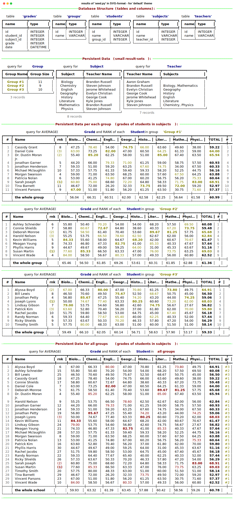
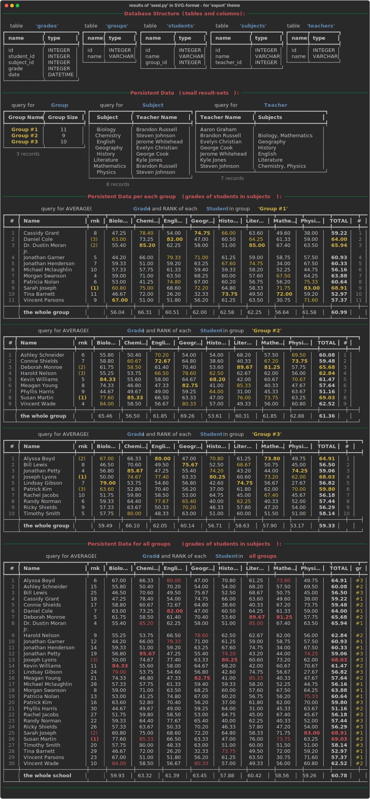

### Requirements
The original requirements in MS-Word and PDF formats are in [folder ./doc](doc). 
In Markdown-format (which is automaically viewable on most of remote presotories) 
it's also available by link [./doc/original-req-UKR.md](doc/original-req-UKR.md).
Unfortunately, it's in ukranian language, but clear and comprehansive enough.

### Prerequisites
In order to execute this lab on any PC, Mac or Linux workstation (or remote terminal)
a standard and [the latest python installation](https://www.python.org/downloads/) must be done first. 
To check that it's available - just execute following commands.
```bash
... > python --version
Python 3.12.0

... > pip --version
pip 23.3.1 from C:\Users\...\Python\Python312\Lib\site-packages\pip (python 3.12)

... > where python
C:\Users\...\Python\Python312\python.exe

... > where pip
C:\Users\...\Python\Python312\Scripts\pip.exe
```
At Mac or Linux the shell-command `which` must be used instead of `where`.

The list of installed python libraries are not really matter because we suppose to
execute our python-modules in virtual python-environment (see bellow). As for later versions
of `python` or `pip` - they also can be upgraded any time (but it's not easy to say the same
about every library that we are using). Upgrading the version of `pip` is very easy. For example,
if we have a little bit outdated one, it will tell us about that in quite every command:
```bash
... > pip list
Package      Version
------------ -------
distlib      0.3.7
filelock     3.12.4
pip          23.3.1
platformdirs 3.11.0
virtualenv   20.24.5

[notice] A new release of pip is available: 23.3.1 -> 24.0
[notice] To update, run: python.exe -m pip install --upgrade pip

... > python.exe -m pip install --upgrade pip
Requirement already satisfied: pip in c:\users\...\python\python312\lib\site-packages (23.3.1)Collecting pip
  Downloading pip-24.0-py3-none-any.whl.metadata (3.6 kB)
Downloading pip-24.0-py3-none-any.whl (2.1 MB)
   ---------------------------------------- 2.1/2.1 MB 7.9 MB/s eta 0:00:00
Installing collected packages: pip
  Attempting uninstall: pip
    Found existing installation: pip 23.3.1
    Uninstalling pip-23.3.1:
      Successfully uninstalled pip-23.3.1
Successfully installed pip-24.0

... > pip --version
pip 24.0 from C:\Users\...\Python\Python312\Lib\site-packages\pip (python 3.12)
```

### Clone this repository
To clone this repository locally just type following command in some dedicated parent-folder:
```bash
... > git clone https://bitbucket.org/aleksey-kurmanov/students-db.git
Cloning into 'students-db'...
remote: Enumerating objects: 44, done.
remote: Counting objects: 100% (44/44), done.
remote: Compressing objects: 100% (43/43), done.
remote: Total 44 (delta 15), reused 0 (delta 0), pack-reused 0
Unpacking objects: 100% (44/44), 67.91 KiB | 205.00 KiB/s, done.
 . . . . . . . it must take up to several seconds  . . . . . . . .
```
... and after that, enter just created sub-directory `students-db` and check that local git-repository is clean:
```bash
... > git status
On branch main
Your branch is up to date with 'origin/main'.

nothing to commit, working tree clean
```
You can read about [command-line utility `git` here](https://git-scm.com/book/en/v2/Getting-Started-The-Command-Line).
Every further shell-commands and snapshots are supposed to be executed from that root directory of
our just cloned local git-repository. The content of it must correspond to content of this remote repository 
except the files and folders that are ignored according to [file `.gitignore`](.gitignore).

### Install python dependencies using `virtaulenv` and `pip`
It's strongly recommended to [create a virtual python-environment](https://docs.python.org/3/library/venv.html) 
in the root folder and install all proper dependencies using 
the standard [utility `pip`](https://pip.pypa.io/en/stable/getting-started/). A standalone utility `virtualenv.exe`
can also be used instead of  `... > python -m venv . . . `. The difference is mostly in administration 
rights (if python interpreter is prohibited and required admin-access). To create a virtual
python-environment we have to type following commands:
```bash
... > python --version
Python 3.12.0

... > pip --version
pip 24.0 from C:\Users\...\Python\Python312\Lib\site-packages\pip (python 3.12)

... > where python
C:\Users\...\Python\Python312\python.exe

... > where pip
C:\Users\...\Python\Python312\Scripts\pip.exe

... > python -m venev
usage: venv [-h] [--system-site-packages] [--symlinks | --copies] [--clear] [--upgrade] [--without-pip] [--prompt PROMPT]
            [--upgrade-deps]
            ENV_DIR [ENV_DIR ...]
venv: error: the following arguments are required: ENV_DIR

... > python -m venv .venv
. . . . . . . . it must take up to ~10-20 seconds  . . . . . . . .

... > .venv\Scripts\activate

(.venv) ... > pip --version
pip 24.0 from C:\Users\...\students-db\.venv\Lib\site-packages\pip (python 3.12)

(.venv) ... > where python
C:\Users\...\students-db\.venv\Scripts\python.exe
C:\Users\...\Python\Python312\python.exe

(.venv) ... > where pip
C:\Users\...\students-db\.venv\Scripts\pip.exe

(.venv) ...> pip list
Package Version
------- -------
pip     24.0
```
At the shippet above we created a virtual environment in a sub-folder `.venv`. That name (the last part of the whole path)
will appear at the prefix of command prompt in round brackets `(.venev)`. It does not really matter
where and by which name such environment is created. It's very important not to run into collision
with other python projects because of conflicts in versions of installed python-libraries. And note that
just created virtual python-environment is _clean_ (`pip list` returns information only about itself).

In any normal operating system (other than Windows) activating the virtual environment
is achieved by executing the source-command `... > . ./.venv/bin/activate` 
(which is exactly the same as `... > source ./.venv/bin/activate`).

Deactivation of virtual environment is achieved by running `deactivate` command. After that the prefix
with virtual-environment name must disappear in command prompt and `...> where python` must show
the original path to python installation.

After virtaul python-environment is created and activated we can install our required dependencies
(third-party python libraries), which are described in a [text-file `requirements.txt`](requirements.txt):
```bash
(.venv) ... > pip install -r requerements.txt
Collecting alembic==1.13.1 (from -r requirements.txt (line 1))
  Using cached alembic-1.13.1-py3-none-any.whl.metadata (7.4 kB)
Collecting Faker==24.4.0 (from -r requirements.txt (line 2))
  Using cached Faker-24.4.0-py3-none-any.whl.metadata (15 kB)
Collecting Mako==1.3.2 (from -r requirements.txt (line 3))
  Using cached Mako-1.3.2-py3-none-any.whl.metadata (2.9 kB)
Collecting markdown-it-py==3.0.0 (from -r requirements.txt (line 4))
  Using cached markdown_it_py-3.0.0-py3-none-any.whl.metadata (6.9 kB)
Collecting MarkupSafe==2.1.5 (from -r requirements.txt (line 5))
  Using cached MarkupSafe-2.1.5-cp312-cp312-win_amd64.whl.metadata (3.1 kB)
Collecting mdurl==0.1.2 (from -r requirements.txt (line 6))
  Using cached mdurl-0.1.2-py3-none-any.whl.metadata (1.6 kB)
Collecting Pygments==2.17.2 (from -r requirements.txt (line 7))
  Using cached pygments-2.17.2-py3-none-any.whl.metadata (2.6 kB)
Collecting python-dateutil==2.9.0.post0 (from -r requirements.txt (line 8))
  Using cached python_dateutil-2.9.0.post0-py2.py3-none-any.whl.metadata (8.4 kB)
Collecting rich==13.7.1 (from -r requirements.txt (line 9))
  Using cached rich-13.7.1-py3-none-any.whl.metadata (18 kB)
Collecting six==1.16.0 (from -r requirements.txt (line 10))
  Using cached six-1.16.0-py2.py3-none-any.whl.metadata (1.8 kB)
Collecting SQLAlchemy==2.0.29 (from -r requirements.txt (line 11))
  Using cached SQLAlchemy-2.0.29-cp312-cp312-win_amd64.whl.metadata (9.8 kB)
Collecting SQLAlchemy-Utils==0.41.2 (from -r requirements.txt (line 12))
  Using cached SQLAlchemy_Utils-0.41.2-py3-none-any.whl.metadata (4.2 kB)
Collecting typing_extensions==4.10.0 (from -r requirements.txt (line 13))
  Using cached typing_extensions-4.10.0-py3-none-any.whl.metadata (3.0 kB)
Collecting greenlet!=0.4.17 (from SQLAlchemy==2.0.29->-r requirements.txt (line 11))
  Using cached greenlet-3.0.3-cp312-cp312-win_amd64.whl.metadata (3.9 kB)
Using cached alembic-1.13.1-py3-none-any.whl (233 kB)
Using cached Faker-24.4.0-py3-none-any.whl (1.8 MB)
Using cached Mako-1.3.2-py3-none-any.whl (78 kB)
Using cached markdown_it_py-3.0.0-py3-none-any.whl (87 kB)
Using cached MarkupSafe-2.1.5-cp312-cp312-win_amd64.whl (17 kB)
Using cached mdurl-0.1.2-py3-none-any.whl (10.0 kB)
Using cached pygments-2.17.2-py3-none-any.whl (1.2 MB)
Using cached python_dateutil-2.9.0.post0-py2.py3-none-any.whl (229 kB)
Using cached rich-13.7.1-py3-none-any.whl (240 kB)
Using cached six-1.16.0-py2.py3-none-any.whl (11 kB)
Using cached SQLAlchemy-2.0.29-cp312-cp312-win_amd64.whl (2.1 MB)
Using cached SQLAlchemy_Utils-0.41.2-py3-none-any.whl (93 kB)
Using cached typing_extensions-4.10.0-py3-none-any.whl (33 kB)
Using cached greenlet-3.0.3-cp312-cp312-win_amd64.whl (293 kB)
Installing collected packages: typing_extensions, six, Pygments, mdurl, MarkupSafe, greenlet, SQLAlchemy, python-dateutil, markdown-it-py, Mako, SQLAlchemy-Utils, rich, Faker, alembic
Successfully installed Faker-24.4.0 Mako-1.3.2 MarkupSafe-2.1.5 Pygments-2.17.2 SQLAlchemy-2.0.29 SQLAlchemy-Utils-0.41.2 alembic-1.13.1 greenlet-3.0.3 markdown-it-py-3.0.0 mdurl-0.1.2 python-dateutil-2.9.0.post0 rich-13.7.1 six-1.16.0 typing_extensions-4.10.0
. . . . . . . . it must take up to several minutes  . . . . . . . .

(.venv) ... > pip list 
Package           Version
----------------- -----------
alembic           1.13.1
Faker             24.4.0
greenlet          3.0.3
Mako              1.3.2
markdown-it-py    3.0.0
MarkupSafe        2.1.5
mdurl             0.1.2
pip               24.0
Pygments          2.17.2
python-dateutil   2.9.0.post0
rich              13.7.1
six               1.16.0
SQLAlchemy        2.0.29
SQLAlchemy-Utils  0.41.2
typing_extensions 4.10.0

(.venev) pip freeze
alembic==1.13.1
Faker==24.4.0
greenlet==3.0.3
Mako==1.3.2
markdown-it-py==3.0.0
MarkupSafe==2.1.5
mdurl==0.1.2
Pygments==2.17.2
python-dateutil==2.9.0.post0
rich==13.7.1
six==1.16.0
SQLAlchemy==2.0.29
SQLAlchemy-Utils==0.41.2
typing_extensions==4.10.0
```
The difference of `pip list ...` and `pip freeze` commands are mostly in output format, and in fact
that the result of `pip freeze > requirements.txt` is used to generate all python-libraries,
which are currently installed (over the whole python installation or at virtual environment).
As far as third-party libraries are under the permanent improvement and extension we want to fix
or _to freeze_ all their versions at some point in order to guarantee the quality of delivery.
When the new version of `SQL-Alchemy` or `Rich` become available it's necessary to perform the upgrade
of corresponding libraries, verify that everything is working as before (regression testing - either
manual or automatic) and commit the changes in [the file `requirements.txt`](requirements.txt).

### Create database structure and seed the data
Our database structure is described via SQL-Alchemy ORM-classes in our
python module [models.py](models.py). After executing that module as a script 
all necessary tables in SQL-Lite single-file database will be created:
```bash
(.venv) ... > python models.py
going to create the database 'sqlite:///school.db'
database 'sqlite:///school.db' was created
. . . . . . . . 
```
Once the database is created the file `school.db` must appear in current directory,
which can be investigated via `sqlite3` utility. If it's not installed at your PC or Mac,
you can read about that at [SQLite Download Page](https://www.sqlite.org/download.html) or 
do it via [`choco` on Windows](https://community.chocolatey.org/packages/SQLite)
or [`brew` on Mac](https://formulae.brew.sh/formula/sqlite). We can run following commands after that:
```bash
... > sqlite3 school.db .dbinfo
database page size:  4096
write format:        1
read format:         1
reserved bytes:      0
file change counter: 7
database page count: 6
freelist page count: 0
schema cookie:       7
schema format:       4
default cache size:  0
autovacuum top root: 0
incremental vacuum:  0
text encoding:       1 (utf8)
user version:        0
application id:      0
software version:    3042000
number of tables:    5
number of indexes:   0
number of triggers:  0
number of views:     0
schema size:         714
data version         1

... > sqlite3 school.db .databases
main: C:\Users\...\students-db\school.db r/w

... > sqlite3 school.db .tables
grades    groups    students  subjects  teachers

... > sqlite3 school.db .schema
CREATE TABLE groups (
        id INTEGER NOT NULL,
        name VARCHAR,
        PRIMARY KEY (id)
);
CREATE TABLE teachers (
        id INTEGER NOT NULL,
        name VARCHAR,
        PRIMARY KEY (id)
);
CREATE TABLE students (
        id INTEGER NOT NULL,
        name VARCHAR,
        group_id INTEGER,
        PRIMARY KEY (id),
        FOREIGN KEY(group_id) REFERENCES groups (id)
);
CREATE TABLE subjects (
        id INTEGER NOT NULL,
        name VARCHAR,
        teacher_id INTEGER,
        PRIMARY KEY (id),
        FOREIGN KEY(teacher_id) REFERENCES teachers (id)
);
CREATE TABLE grades (
        id INTEGER NOT NULL,
        student_id INTEGER,
        subject_id INTEGER,
        grade INTEGER,
        date DATETIME,
        PRIMARY KEY (id),
        FOREIGN KEY(student_id) REFERENCES students (id),
        FOREIGN KEY(subject_id) REFERENCES subjects (id)
);
```
We can also run DML commands (SQL queries) using `sqlite3` utility. At the moment
all tables we've just created are empty and dot-command `.dump` of `sqlite3` utility
must have quite the same output as `.schema` command above. But we can access system tables like 
`sqlite_schema` in following way:
```bash
... > sqlite3 -box school.db "SELECT type, name FROM sqlite_schema"
┌───────┬──────────┐
│ type  │   name   │
├───────┼──────────┤
│ table │ groups   │
│ table │ teachers │
│ table │ students │
│ table │ subjects │
│ table │ grades   │
└───────┴──────────┘

... > sqlite3 -box school.db "SELECT * FROM sqlite_schema"
┌───────┬──────────┬──────────┬──────────┬────────────────────────────────────────────────────────────┐
│ type  │   name   │ tbl_name │ rootpage │                            sql                             │
├───────┼──────────┼──────────┼──────────┼────────────────────────────────────────────────────────────┤
│ table │ groups   │ groups   │ 2        │ CREATE TABLE groups (                                      │
│       │          │          │          │         id INTEGER NOT NULL,                               │
│       │          │          │          │         name VARCHAR,                                      │
│       │          │          │          │         PRIMARY KEY (id)                                   │
│       │          │          │          │ )                                                          │
├───────┼──────────┼──────────┼──────────┼────────────────────────────────────────────────────────────┤
│ table │ teachers │ teachers │ 3        │ CREATE TABLE teachers (                                    │
│       │          │          │          │         id INTEGER NOT NULL,                               │
│       │          │          │          │         name VARCHAR,                                      │
│       │          │          │          │         PRIMARY KEY (id)                                   │
│       │          │          │          │ )                                                          │
├───────┼──────────┼──────────┼──────────┼────────────────────────────────────────────────────────────┤
│ table │ students │ students │ 4        │ CREATE TABLE students (                                    │
│       │          │          │          │         id INTEGER NOT NULL,                               │
│       │          │          │          │         name VARCHAR,                                      │
│       │          │          │          │         group_id INTEGER,                                  │
│       │          │          │          │         PRIMARY KEY (id),                                  │
│       │          │          │          │         FOREIGN KEY(group_id) REFERENCES groups (id)       │
│       │          │          │          │ )                                                          │
├───────┼──────────┼──────────┼──────────┼────────────────────────────────────────────────────────────┤
│ table │ subjects │ subjects │ 5        │ CREATE TABLE subjects (                                    │
│       │          │          │          │         id INTEGER NOT NULL,                               │
│       │          │          │          │         name VARCHAR,                                      │
│       │          │          │          │         teacher_id INTEGER,                                │
│       │          │          │          │         PRIMARY KEY (id),                                  │
│       │          │          │          │         FOREIGN KEY(teacher_id) REFERENCES teachers (id)   │
│       │          │          │          │ )                                                          │
├───────┼──────────┼──────────┼──────────┼────────────────────────────────────────────────────────────┤
│ table │ grades   │ grades   │ 6        │ CREATE TABLE grades (                                      │
│       │          │          │          │         id INTEGER NOT NULL,                               │
│       │          │          │          │         student_id INTEGER,                                │
│       │          │          │          │         subject_id INTEGER,                                │
│       │          │          │          │         grade INTEGER,                                     │
│       │          │          │          │         date DATETIME,                                     │
│       │          │          │          │         PRIMARY KEY (id),                                  │
│       │          │          │          │         FOREIGN KEY(student_id) REFERENCES students (id),  │
│       │          │          │          │         FOREIGN KEY(subject_id) REFERENCES subjects (id)   │
│       │          │          │          │ )                                                          │
└───────┴──────────┴──────────┴──────────┴────────────────────────────────────────────────────────────┘
```
Information about SQL language can be found [here](https://www.w3schools.com/sql/sql_intro.asp).
As for DML statements (we mostly use `SELECT ...`), which are supported by that SQL-Lite database, 
- you can read it about that [here](https://www.sqlite.org/lang.html) 
and [here](https://www.sqlite.org/lang_select.html).

Now let's [__seed__ our database](https://medium.com/@melissavaiden/seed-data-for-your-database-f3f0cb868f1a) 
with some fake data. We have to use our python-module `seed.py` for that:
```bash
(.venv) ... > python seed.py
Going to seed the database 'sqlite:///school.db' with following parameters:
- GROUPS_COUNT = 3
- TEACHERS_COUNT = 7
- STUDENTS_COUNT = 30
- len(SUBJECTS) = 8
- RANDOM_SEED = 123
Database seeding is completed!
===========================
```
It uses the third-party library [Faker](https://faker.readthedocs.io/en/master/) 
and standard [random-generators of python](https://docs.python.org/3/library/random.html).

After that - dot-command `.dump` of `sqlite3` utility must return a lot of `INSERT` SQL-instructions
in addition to `CREATE TABLE ...` as we saw above:
```bash
... > sqlite3 -box school.db .dump
PRAGMA foreign_keys=OFF;
BEGIN TRANSACTION;
CREATE TABLE groups (
        id INTEGER NOT NULL,
        name VARCHAR,
        PRIMARY KEY (id)
);
INSERT INTO "groups" VALUES(1,'Group #1');
INSERT INTO "groups" VALUES(2,'Group #2');
INSERT INTO "groups" VALUES(3,'Group #3');
CREATE TABLE teachers (
        id INTEGER NOT NULL,
        name VARCHAR,
        PRIMARY KEY (id)
);
INSERT INTO teachers VALUES(1,'Brandon Russell');
INSERT INTO teachers VALUES(2,'Steven Johnson');
INSERT INTO teachers VALUES(3,'Evelyn Christian');
INSERT INTO teachers VALUES(4,'George Cook');
INSERT INTO teachers VALUES(5,'Aaron Graham');
INSERT INTO teachers VALUES(6,'Kyle Jones');
INSERT INTO teachers VALUES(7,'Jerome Whitehead');
CREATE TABLE students (
        id INTEGER NOT NULL,
        name VARCHAR,
        group_id INTEGER,
        PRIMARY KEY (id),
        FOREIGN KEY(group_id) REFERENCES groups (id)
);
INSERT INTO students VALUES(1,'Deborah Monroe',2);
INSERT INTO students VALUES(2,'Harold Nelson',2);
INSERT INTO students VALUES(3,'Alyssa Boyd',3);
. . . . . . . . . . . . . . . . . . . . . . . . . . . . . . . .
. . . . . . . . . . . . . . . . . . . . . . . . . . . . . . . .
INSERT INTO students VALUES(29,'Dominic Dillon',3);
INSERT INTO students VALUES(30,'Nathan Dennis',3);
CREATE TABLE subjects (
        id INTEGER NOT NULL,
        name VARCHAR,
        teacher_id INTEGER,
        PRIMARY KEY (id),
        FOREIGN KEY(teacher_id) REFERENCES teachers (id)
);
INSERT INTO subjects VALUES(1,'Mathematics',1);
INSERT INTO subjects VALUES(2,'Literature',6);
INSERT INTO subjects VALUES(3,'Physics',2);
INSERT INTO subjects VALUES(4,'Chemistry',2);
INSERT INTO subjects VALUES(5,'English',7);
INSERT INTO subjects VALUES(6,'Biology',1);
INSERT INTO subjects VALUES(7,'Geography',3);
INSERT INTO subjects VALUES(8,'History',4);
CREATE TABLE grades (
        id INTEGER NOT NULL,
        student_id INTEGER,
        subject_id INTEGER,
        grade INTEGER,
        date DATETIME,
        PRIMARY KEY (id),
        FOREIGN KEY(student_id) REFERENCES students (id),
        FOREIGN KEY(subject_id) REFERENCES subjects (id)
);
INSERT INTO grades VALUES(1,1,1,90,'2023-10-19 15:38:04.000000');
INSERT INTO grades VALUES(2,1,1,98,'2023-06-19 09:24:48.000000');
INSERT INTO grades VALUES(3,1,1,93,'2023-12-04 02:57:29.000000');
INSERT INTO grades VALUES(4,1,1,80,'2023-11-05 09:45:50.000000');
INSERT INTO grades VALUES(5,1,2,92,'2023-09-01 17:09:50.000000');
. . . . . . . . . . . . . . . . . . . . . . . . . . . . . . . .
. . . . . . . . . . . . . . . . . . . . . . . . . . . . . . . .
INSERT INTO grades VALUES(949,30,8,78,'2023-05-03 08:30:32.000000');
INSERT INTO grades VALUES(950,30,8,76,'2024-02-22 17:45:37.000000');
INSERT INTO grades VALUES(951,30,8,84,'2023-05-24 13:18:49.000000');
INSERT INTO grades VALUES(952,30,8,97,'2023-07-14 16:03:25.000000');
INSERT INTO grades VALUES(953,30,8,63,'2024-02-15 04:23:51.000000');
COMMIT;
```
Note, that `school.db` file (and any files with `.db` extensions) are ignored by our git-repository.
You can see it in our [`.gitignore` file](.gitignore#lines-7)

### Dump the basic entities and deeper relationships
The content of just created tables can be verified via `sqlite3` utility.
For example our table `subjects` contains following:
```bash
... > sqlite3 -box school.db "SELECT * from subjects"
┌────┬─────────────┬────────────┐
│ id │    name     │ teacher_id │
├────┼─────────────┼────────────┤
│ 1  │ Mathematics │ 1          │
│ 2  │ Literature  │ 6          │
│ 3  │ Physics     │ 2          │
│ 4  │ Chemistry   │ 2          │
│ 5  │ English     │ 7          │
│ 6  │ Biology     │ 1          │
│ 7  │ Geography   │ 3          │
│ 8  │ History     │ 4          │
└────┴─────────────┴────────────┘
```
End-users must not see our internal IDs, which we are using to organize 
the relationship between data in tables. So, we have to display the data in more
user-friendly way. It's implemented in `reports.py` module,
which dumps some debugging garbage and finally outputs some fancy reports at terminal console:
```bash
(.venv) ... > python reports.py
engine.url = sqlite:///school.db
engine.driver = 'pysqlite'
inspector.get_schema_names() = ['main']
inspector.get_table_names() = ['grades', 'groups', 'students', 'subjects', 'teachers']

Getting the content of table 'groups' with raw SQL:
- using the query << SELECT * FROM groups >>
- [(1, 'Group #1'), (2, 'Group #2'), (3, 'Group #3')]
---------------------------
Getting the content of table 'teachers' with raw SQL:
- using the query << SELECT * FROM teachers >>
- [(1, 'Brandon Russell'), (2, 'Steven Johnson'), . . . . . . .
---------------------------
Getting the content of table 'subjects' with raw SQL:
- using the query << SELECT * FROM subjects >>
- [(1, 'Mathematics', 1), (2, 'Literature', 6), (3, 'Physics', 2), . . . . . . .
---------------------------
Getting the list of all students with raw SQL:
- using the query for students << SELECT * FROM students >>
- (1, 'Deborah Monroe', 2);
- (2, 'Harold Nelson', 2);
. . . . . . . . . . . . . . . . . . . . . . . . . . . . . . . .
- (29, 'Dominic Dillon', 3);
- (30, 'Nathan Dennis', 3);
===========================

- 'Group' records via SQL-Alchemy session: ['group("Group #1" of 8 students)',  . . . . . . .
~~~~~~~~~~~~~~~~~~~~~~~~~~~
- 'Teacher' records via SQL-Alchemy session: ["teacher'Brandon Russell')", "teac . . . . . . .
~~~~~~~~~~~~~~~~~~~~~~~~~~~
- 'Subject' records via SQL-Alchemy session: ["subject<Mathematics by teacher'Brand . . . . . . .
~~~~~~~~~~~~~~~~~~~~~~~~~~~
- joined loading groups: ['group("Group #1" of 8 students)', 'group("Group #2" of  . . . . . . .
===========================
. . . . . . . . . . . . . . . . . . . . . . . . . . . . . . . . . . .
. . . . . see the generated captures in SVG and HTML formats  . . . .
. . . . . . . . . . . . . . . . . . . . . . . . . . . . . . . . . . .
output is captured and saved in 'C:\...\students-db\export\svg\reports--default.svg' as SVG
output is captured and saved in 'C:\...\students-db\export\svg\reports--dimmed.svg' as SVG
output is captured and saved in 'C:\...\students-db\export\svg\reports--monokai.svg' as SVG
output is captured and saved in 'C:\...\students-db\export\svg\reports--night.svg' as SVG
output is captured and saved in 'C:\...\students-db\export\svg\reports--export.svg' as SVG

output is captured and saved in 'C:\...\students-db\export\html\reports--default.html' as HTML
output is captured and saved in 'C:\...\students-db\export\html\reports--dimmed.html' as HTML
output is captured and saved in 'C:\...\students-db\export\html\reports--monokai.html' as HTML
output is captured and saved in 'C:\...\students-db\export\html\reports--night.html' as HTML
output is captured and saved in 'C:\...\students-db\export\html\reports--export.html' as HTML
```

### Output our reports using `rich`-console
The output of python-module `reports.py` is too fancy to copy-paste it here (foreground and
background manipulations with colors are prohibited at [Bit-Bucket](https://bitbucket.org/product) 
and [Git-Hub](https://github.com/)) and unfortunately it does not look the same at all terminals 
(especially, at my favorite operating system Windows - it looks ugly!).

Nevertheless, [`rich`-console](https://rich.readthedocs.io/en/stable/console.html) 
allows to capture the output and export it
in SVG and HTML format in different themes (5 ones come out of the box, but you can provide your own). 
Our module `reports.py` performs it into sub-folder [export](export). 
As for SVG-files we can refer them right from the current page.
You can read more details about python-lybrary 
[**Rich** here](https://rich.readthedocs.io/en/stable/index.html) or
checkout the sources with examples [from their Git-Hub repositotry](https://github.com/Textualize/rich).

The output of terminals in a light-theme must look like:


And the dark-theme (most of Windows) must be similar to:


As for HTML-files - each of them can be open directly via browser.
In some minor details look-and-feel of theose themes and formats is different.
But in general the values (grades and students) must be always the same
(unless you change the data in database).

> <hr/>
> __ Let me know whether you are able to repeat all this stuff locally! __
> <hr/>
